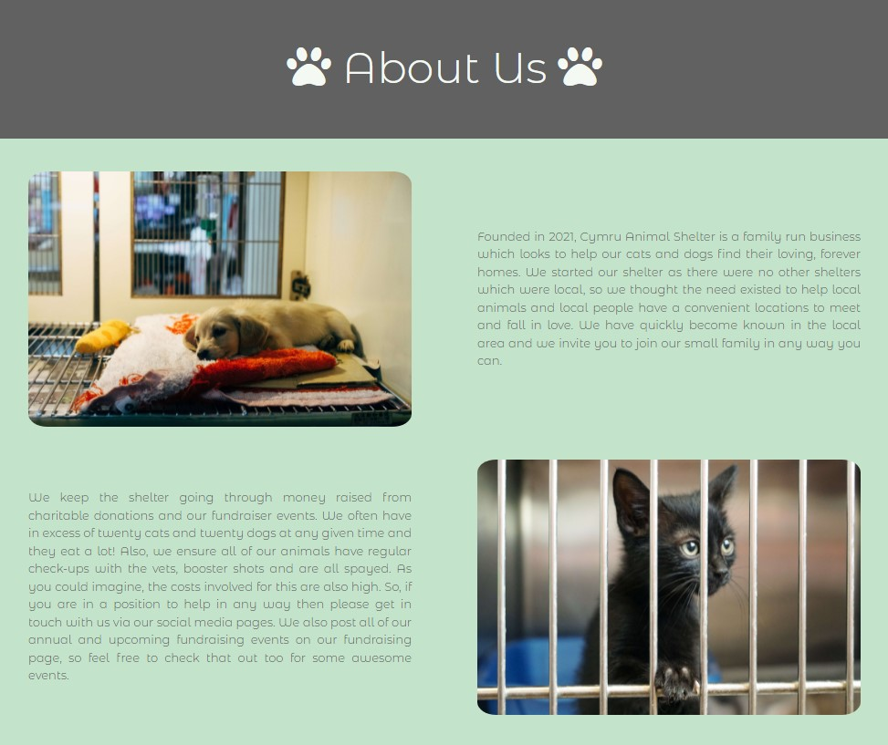

# **
Cymru Animal Shelter
**

Developer: Keith Kerswell

[Live webpage](https://kkerswell.github.io/CI_PP1_AnimalCharity/)

## Table of Contents

1. [Project Goals](#project-goals)
    1. [User Goals](#user-goals)
    2. [Site Owner Goals](#site-owner-goals)
2. [User Experience](#user-experience)
    1. [Target Audience](#target-audience)
    2. [User Requrements and Expectations](#user-requrements-and-expectations)
    3. [User Stories](#user-stories)
3. [Design](#Design)
    1. [Design Choices](#design-choices)
    2. [Colour Scheme](#colour-scheme)
    3. [Fonts](#fonts)
    4. [Images and Video](#images-and-video)
    5. [Structure](#structure)
    6. [Wireframes](#wireframes)
4. [Technologies Used](#technologies-used)
    1. [Languages](#languages)
    2. [Frameworks & Tools](#frameworks--tools)
5. [Features](#features)
    1. [Logo and Navigation Bar](#logo-and-navigation-bar)
    2. [Footer](#footer)
    3. [Homepage](#homepage)
    4. [About Us](#about-us)
    5. [Our Animals](#our-animals)
    6. [Fundraising](#fundraising)
    7. [Contact Form](#contact-form)
    8. [Map and address](#map-and-address)
6. [Development](#development)
    1. [Building and Maintaining](#building-and-maintaining)
    2. [Commits](#commits)
    3. [Deployment](#deployment)
7. [Testing](#validation)
    1. [HTML Validation](#html-validation)
    2. [CSS Validation](#css-validation)
    3. [Accessibility](#accessibility)
    4. [Performance](#performance)
    5. [Device testing](#performing-tests-on-various-devices)
    6. [Browser compatibility](#browser-compatability)
    7. [Testing user stories](#testing-user-stories)
8. [Bugs](#Bugs)
9. [Credits](#credits)
10. [Acknowledgements](#acknowledgements)

## Project Goals 

### User Goals
- Find an animal shelter that has available animals for adoption.
- Find information about the animal shelter.
- Contact the animal shelter.
- Find the location of the animal shelter.
- Find any fundraising activites.

### Site Owner Goals
- Attract people who want to adopt an animal.
- Provide a way for people looking to adopt an animal to easily contact the animal shelter.
- Have a page dedicated to advertising annual fundraising events.
- Have a gallery of all animals currently available for adoption.

## User Experience

### Target Audience
- People looking to adopt an animal.
- People looking to attend a fundraising event

### User Requrements and Expectations

- A simple and intuitive navigation system
- Quickly and easily find relevant information
- Links and functions that work as expected
- Good presentation and a visually appealing design regardless of screen size
- An easy way to contact the animal shelter
- Simple content that the user can skim read
- Accessibility

### User Stories

#### First-time User 
1. As a first time user, I want to know where the animal shelter is located
2. As a first time user, I want to know the animals available for adoption
3. As a first time user, I want to know more about the animal shelter
4. As a first time user, I want to know about any fundraising activities
5. As a first time user, I want to be able to contact the animal shelter

#### Returning User
6. As a returning user, I want to know which animals are available for adoption
7. As a returning user, I want to know about any fundraising activities
8. As a returning user, I want to be able to contact the animal shelter

#### Site Owner 
9. As the site owner, I want users to find information about upcoming fundraising activities.
10. As the site owner, I want users to find information about available animals ready for adoption.
11. As the site owner, I want users to get to know the animal shelter. 
12. As the site owner, I want the users to be able to contact us.

## Design

### Design Choices

The webpage was designed with the feeling a customer might get while dining at the restaurant. It is calm, warm and inviting. Some of the imagery on the page has a round shape with a border to resemble food served on a plate.
   
### Colour Scheme
- Create a modern colour scheme with soft tones
- Primary background of the website will be white, so this would need to form part of the palette.
- The goal is to choose gender-neutral colours.
- Final palette colours that were chosen were #F4F9F4 #C4E3CB #8AAE92 #616161
- Source: https://colorhunt.co/palette/f4f9f4c4e3cb8aae92616161

### Fonts
- Create a modern look with soft lines
- Final font chosen was Montserrat Alternates by Google Fonts
- Source: https://fonts.google.com/specimen/Montserrat+Alternates?query=Montserrat+Alternates

### Images and Video
- If the site was live then the companies own images/video would be used
- For the project, royalt free imagry is required
- Include pictures of cats and dogs
- sources (images): https://unsplash.com/
- Sources (video): https://www.pexels.com/

### Structure
The page is structured in a well know, recognisable, user friendly, and easy to learn way. 
    
Upon arriving to the website the user sees a familiar type of navigation bar and footer bar. 
    
The website consists of five separate pages: 
- A homepage with a sections for News and Sunday Meal Offers
- An about page with the About Us and Meet the Chef
- A menu page
- A image gallery with images and video showcasing the general feel of the restaurant
- A contact page with a contact form, a map and information about the bussines section

## Wireframes

Home

About

Animals

Fundraising

Contact Us

## Technologies Used

### Languages
- HTML
- CSS

### Frameworks & Tools
- Git
- GitHub
- Gitpod
- Balsamiq
- Google Fonts
- Font Awsome
- TinyPNG.com
- Favicon.io

## Features
The page consists of five pages and twelve features

### Logo and Navigation Bar
- Featured on all five pages
- The navbar is fully responsive and includes links to the Homepage, About page, Our Animals page, Fundraising page and Contact us page
- It allows users to easily navigate the page
- The link for the page the user is currently on is underlined

### Footer
- Featured on all five pages
- Fully responsive
- Consists of two seperate sections: Copyright information and social media links

### Homepage
- The homepage shows a hero image and striking text to give an impactful first impression to the site

### About Us
- Gives a description of the animal shelter and its purpose with images of animals
- Video to show volunteers
- The page is fully responsive and changes layout on smaller screens
- User stories covered: 3, 11

### Our Animals
- Features all currently available animals for adoption with image, name and age
- Features a page navigation at the top for cats and dogs. This will be best utilised for the user when there is a large number of animals available
- The page is fully responsive and changes layout on smaller screens
- User stories covered: 2, 6, 10

### Fundraising
- Features a list of all upcoming fundraising activies including month, event name, full date and description
- The page is fully responsive and changes layout on smaller screens
- User stories covered: 4, 7

### Contact Form
- A way for users to enquire about animals
- User stories covered: 5, 8, 12

### Map and address
- Shows the Animal Shelter's address
- Shows the Animal Shelter's location on an embeded Google Map
- Fully responsive and changes layout on smaller screens
- User stories covered: 1, 5, 8, 12

## Development 

### Building and Maintaining

GitHub was used as version control software to maintain, upload and share code with other developers.

GitPod was used to write the code.

### Commits

I kept track of updates by using commits in Git.  The terminal commands for these were:

* git add .
* git commit -m "Description of change"
* git push

### Deployment

The website was deployed to GitHub Pages.

To complete this action I completed the following process:

1. Navigated to my site repository

    https://github.com/kkerswell/CI_PP1_AnimalCharity

2. Clicked on "Settings" within the top navigation area

Picture

3. Clicked on "Pages" within the side navigation area

Picture

4. Clicked the dropdown box under "Source" and choose "main"

Picture

5. Clicked on the "Save" button

Picture

6. Once saved, the url is then provided

Picture

## Testing

### HTML Validation

https://validator.w3.org/ was used to validate HTML.

1. index.html

Picture

2. about.html

Picture

3. animals.html

Picture

4. fundraising.html

Picture

5. contactus.html

Picture

### CSS Validation

https://jigsaw.w3.org/css-validator/ was used to validate CSS.

Picture

### Accessibility

https://wave.webaim.org/ was used to test accessibility.

The results were as follows:

1. Errors
    * 3 x Errors for broken links. However, these were for the three social links in the footer and is currently expected behaviour.
2. Contrast Errors
    * Where I had grey text on a green background, I had warnings for low contrast. However, I felt the colours worked well and decided to keep them.
3. Alerts
    * 1 x Alert for HTML5 video or audio. However, this was only for video with audio and the site recommended providing synchronized captioning and a transcript, the video I used did not have any audio included.

### Performance

https://developers.google.com/web/tools/lighthouse was used to test performance.

Picture

### Responsiveness

http://ami.responsivedesign.is was used to test responsiveness.

1. index.html

Picture

2. about.html

Picture

3. animals.html

Picture

4. fundraising.html

Picture

5. contactus.html

Picture

## Problems

* spacing the a links in the nav bar.  I originally tried to add margin and padding but this was having an undesired effect.  I got arround this by adding line-height to the nav a section.
* When Adding a h1 to the header, the alignment of both h1 and nav changed to an undesired style. I struggled to get the h1 to align left and the nav to align right.  I then changed both to display inline but the nav was then aligned right next to the h1 on the right side of the page, when I wanted it on the left. I overcame this by adding float right to the nav.
* When hosting page on GitHub pages, the site did not work correctly.  I had to change all file paths to relative in order for this to work.
* On the index page, I wanted a large full-scale image to cover the screen with a text overlay.  Whilst I managed to achieve this, I found I experienced issues when it came to responsive design. I attempted several fixes but ultimately I decided to change the design of the page to allow for easier coding and responsiveness.
* When trying to style the images in the animal_hero div on the About Us page, I had an issue where the cat image was being pushed off the side of the page. I had to utilise Bootstrap in order to get the styling I wanted for this.

## Credits

* https://commonmark.org/help/
* https://colorhunt.co/
* https://www.w3schools.com/css/css3_variables.asp
* https://unsplash.com/
* https://fontawesome.com/
* https://fonts.google.com/
* https://stackoverflow.com/
* https://colorhunt.co/
* https://favicon.io/emoji-favicons/dog-face

## Acknowledgements

I would like to take the opportunity to thank:

- My mentor Mo Shami for his feedback, advice, guidance and support.
- The  Code Institute Slack community for providing assistance and peer code reviews.